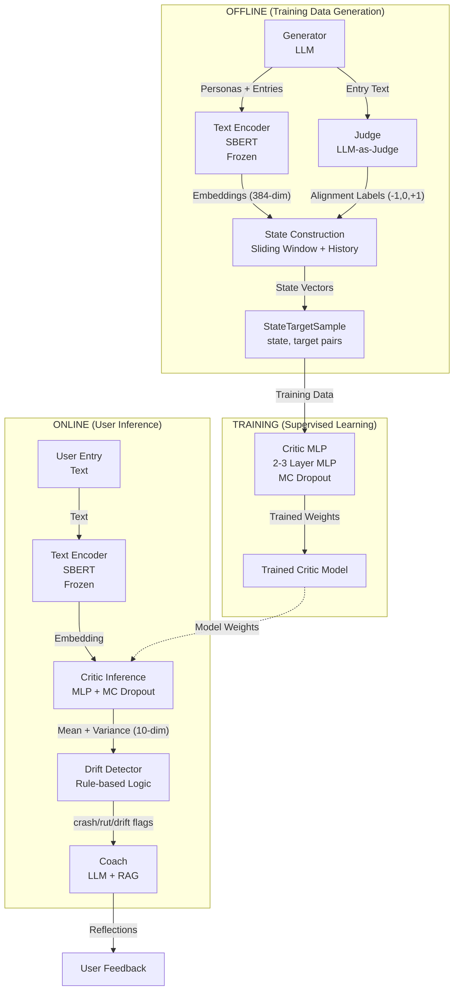

## Overall ML Pipeline


### 🔄 VIF Pipeline: Models & Outputs at Each Step




---

## 📋 Detailed Model Breakdown

### **Step 1: Text Encoder (Frozen)**
| Attribute | Value |
|-----------|-------|
| **Model** | Sentence-BERT (e.g., `all-MiniLM-L6-v2`) |
| **Type** | Pretrained transformer, **frozen** (no fine-tuning) |
| **Input** | Raw journal text $T_{u,t}$ |
| **Output** | Fixed-length embedding $\mathbf{e}_{u,t} \in \mathbb{R}^{d_e}$ (e.g., 384-dim) |
| **When Used** | Offline preprocessing of all entries |
| **Purpose** | Convert text to dense vectors for the Critic |

```
"Skipped gym again, feeling guilty about work deadlines..."
                    ↓
              [0.23, -0.41, 0.87, ..., 0.12]  (384 floats)
```

---

### **Step 2: Generator (LLM)**
| Attribute | Value |
|-----------|-------|
| **Model** | GPT-5-mini (or similar LLM) |
| **Type** | Large language model, API-based |
| **Input** | Persona config (age, profession, culture, Schwartz values) + prompts |
| **Output** | Synthetic `Persona` + `JournalEntry` objects |
| **When Used** | Dataset creation (training data synthesis) |
| **Purpose** | Generate diverse, realistic training data |

```python
# Output: Persona
{
  "name": "Yuna Park",
  "age": "31",
  "profession": "Parent (Stay-at-home)",
  "culture": "East Asian",
  "core_values": ["Benevolence", "Universalism"],
  "bio": "Yuna left her preschool job after her daughter was born..."
}

# Output: JournalEntry
{
  "date": "2023-10-27",
  "content": "The food pantry shift ran late again..."
}
```

---

### **Step 3: Judge (LLM-as-Judge) — THE TEACHER**
| Attribute | Value |
|-----------|-------|
| **Model** | LLM (GPT-4 / GPT-5) |
| **Type** | Large language model with structured output |
| **Input** | Journal entry text + Persona profile + Value rubrics |
| **Output** | **Alignment vector** $\hat{\vec{a}}_{u,t} \in \{-1, 0, +1\}^{10}$ |
| **When Used** | Offline labeling of all synthetic entries |
| **Purpose** | Create ground-truth training labels for the Critic |

```python
# Input: Entry text + persona context
# Output: Per-dimension alignment scores

{
  "Self-Direction": 0,    # Neutral
  "Stimulation": 0,       # Neutral
  "Hedonism": -1,         # Misaligned (neglecting pleasure/rest)
  "Achievement": +1,      # Aligned (work focus)
  "Power": 0,             # Neutral
  "Security": -1,         # Misaligned (financial stress mentioned)
  "Conformity": 0,        # Neutral
  "Tradition": 0,         # Neutral
  "Benevolence": +1,      # Aligned (helping family)
  "Universalism": 0       # Neutral
}
```

**Rubric (3-point categorical):**
- **-1 (Misaligned):** Entry actively conflicts with this value
- **0 (Neutral):** Entry is irrelevant or maintains status quo
- **+1 (Aligned):** Entry actively supports this value

---

### **Step 4: Critic (MLP with MC Dropout) — THE STUDENT**
| Attribute | Value |
|-----------|-------|
| **Model** | Multi-layer Perceptron (2-3 hidden layers) |
| **Type** | Supervised regressor, **trained from scratch** |
| **Input** | State vector $s_{u,t}$ (see below) |
| **Output** | Predicted alignment $\hat{\vec{a}}_{u,t} \in [-1, 1]^{10}$ + uncertainty $\vec{\sigma}_{u,t}$ |
| **When Used** | Real-time inference on user entries |
| **Purpose** | Fast, uncertainty-aware alignment estimation |

**State Vector Input** ($\approx$1,174 dimensions for POC):
```
s_{u,t} = Concat[
    e_{t},      # Current entry embedding (384)
    e_{t-1},    # Previous entry embedding (384)  
    e_{t-2},    # Entry before that (384)
    Δt_{t},     # Days since last entry (1)
    Δt_{t-1},   # Days between t-1 and t-2 (1)
    EMA[10],    # Per-dimension alignment EMA (10)
    w_u[10]     # User value weights (10)
]
```

**Output (with MC Dropout):**
```python
# Run N=50 forward passes with dropout active
predictions = [model(s_ut) for _ in range(50)]

# Per-dimension results
{
  "mean": [0.72, -0.41, 0.15, ...],      # μ for each dimension
  "std":  [0.08, 0.31, 0.12, ...],       # σ (uncertainty) for each dimension
}
```

**Architecture:**
```
Input (1174) → Dense(512) + ReLU + Dropout(0.2)
            → Dense(256) + ReLU + Dropout(0.2)
            → Dense(10) Linear output
```

---

### **Step 5: Drift Detection (Deterministic Rules)**
| Attribute | Value |
|-----------|-------|
| **Model** | **None** — pure rule-based logic |
| **Type** | Threshold-based triggers |
| **Input** | Critic outputs + user profile $w_u$ |
| **Output** | Boolean flags: `crash`, `rut`, `identity_drift` |
| **When Used** | After Critic inference, before Coach |
| **Purpose** | Decide whether to trigger feedback |

**Example Rules:**
```python
# Crash Detection (sudden drop)
if (V_prev[j] - V_curr[j] > δ_crash) and (σ_curr[j] < ε):
    trigger_crash(dimension=j)

# Rut Detection (chronic low)
if (V_curr[j] < τ_low) and (consecutive_weeks >= 3) and (σ_curr[j] < ε):
    trigger_rut(dimension=j)

# Profile-weighted drift
drift_score = w_u · max(0, -â_ut)  # Weighted misalignment
```

---

### **Step 6: Coach (LLM + RAG)**
| Attribute | Value |
|-----------|-------|
| **Model** | LLM (GPT-4 / GPT-5) + Vector retrieval |
| **Type** | Retrieval-Augmented Generation |
| **Input** | Critic flags + retrieved past entries + user profile |
| **Output** | Natural language reflection/prompt for the user |
| **When Used** | Only when Critic triggers a crash/rut/drift event |
| **Purpose** | Generate evidence-based, gentle accountability feedback |

```
Critic flags: "Benevolence rut detected (3 weeks)"
                    ↓
RAG retrieves: Past entries mentioning family, helping others
                    ↓
Coach output: "You've mentioned wanting to be there for your 
              sister three times this month, but your entries 
              suggest work has been pulling you away. Is this 
              a trade-off you're okay with right now?"
```

---

## 📊 Summary Table

| Step | Model | Training | Input | Output |
|------|-------|----------|-------|--------|
| **1. Encode** | SBERT | Pretrained (frozen) | Text | Embedding ∈ ℝ³⁸⁴ |
| **2. Generate** | GPT-5-mini | N/A (inference) | Config | Personas + Entries |
| **3. Judge** | GPT-4/5 | N/A (inference) | Text + Profile | {-1,0,+1}¹⁰ labels |
| **4. Critic** | MLP | **Trained** (supervised) | State vector | μ, σ ∈ ℝ¹⁰ |
| **5. Detect** | Rules | N/A | Critic output | crash/rut flags |
| **6. Coach** | GPT + RAG | N/A (inference) | Flags + history | Reflection text |

---

## 🎯 Current Status

| Model | Status |
|-------|--------|
| Text Encoder (SBERT) | 🟡 Chosen, not yet integrated |
| Generator (LLM) | ✅ **Working** in `journal_gen.ipynb` |
| Judge (LLM) | 🔲 Not implemented |
| Critic (MLP) | 🔲 Not implemented |
| Drift Rules | 🔲 Not implemented |
| Coach (RAG) | 🔲 Not implemented |


---
